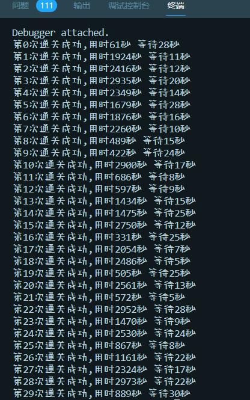
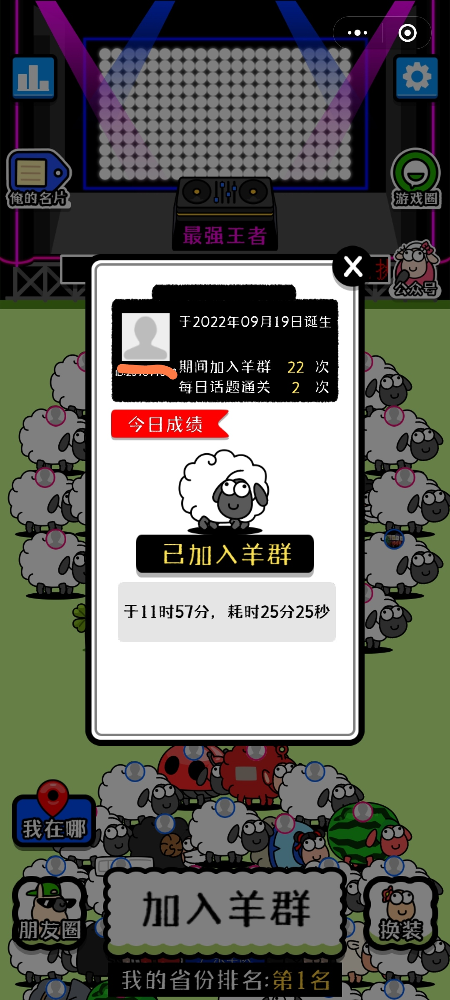

<div align="center"></div>

# 羊(🐴)了个羊(💪)

快速通关 nodejs 版
> 注意：本方法不提供获取 t 值的方法，需自备

## 食用方法
1. 克隆本仓库(需提前准备好node环境)
```bash
git clone https://github.com/ltxhhz/sheep-sheep
```
2. 在项目目录下运行，等待进度完成
```bash
npm i
```
3. 在`index.js`文件中传入 t 值
```js
const sheep = new Sheep("这里是你的t值")
```
4. 在项目目录下运行后查看输出就可以了
```bash
node index.js
```
5. 也可自己修改脚本自定义功能

## 运行结果



> 次数增加了

## 鸣谢
感谢[@djerryz](https://github.com/djerryz)/[Sheep_Sheep_Ni](https://github.com/djerryz/Sheep_Sheep_Ni)提供的思路

## 说明
仅供学习使用，如有侵权请联系我删除